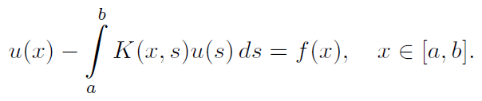
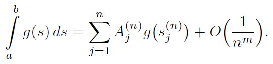
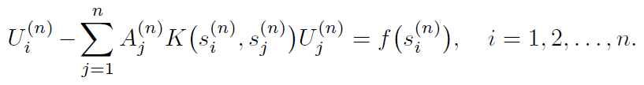
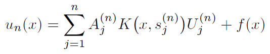
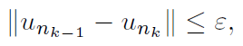
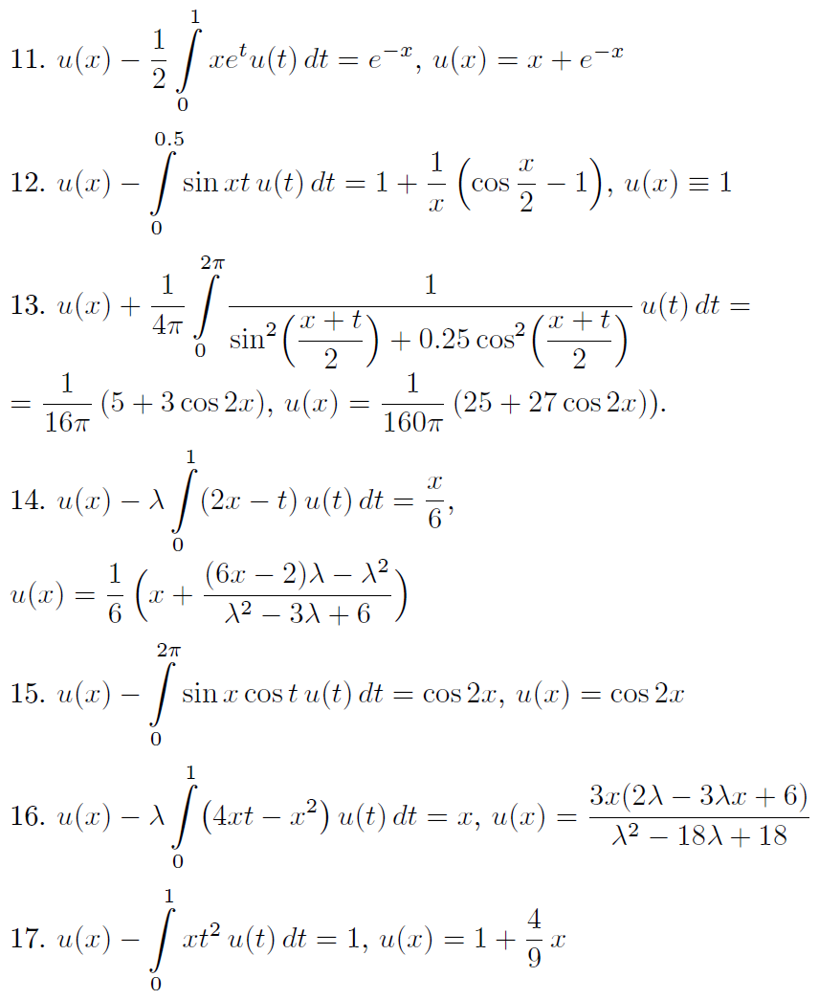
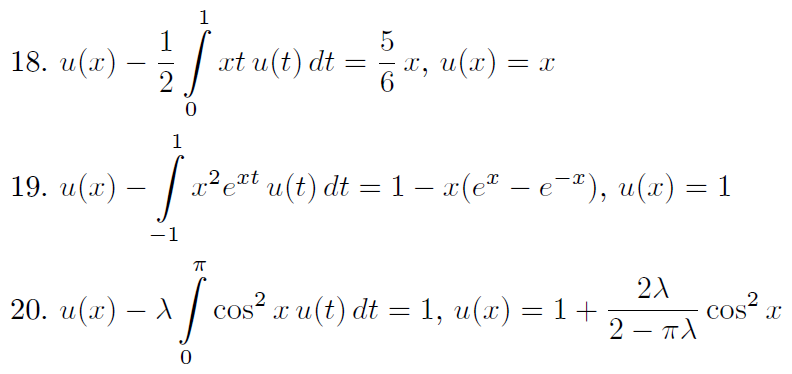

An example of using CUDA technology for the numerical solution of the [Fredholm integral equation of the second kind](https://en.wikipedia.org/wiki/Fredholm_integral_equation#Equation_of_the_second_kind):

  

# Algorithm

The integral is approximated by a compound [quadrature formula](https://en.wikipedia.org/wiki/Numerical_integration#Quadrature_rules_based_on_interpolating_functions) of order m:

  

For the rectangle and trapezoidal rule m is equals 2 and for Simpson's rule m is equals 4. After substituting this formula into the integral equation and neglecting the small error of the quadrature formula, for each partition point of the segment [a,b] we obtain a linear equation:

  

Finally, solving this system, we obtain an approximation for the desired function by the formula:

  

The mesh convergence is estimated by the relation:

  

where the integral in the [norm of the L2 space](https://en.wikipedia.org/wiki/Norm_(mathematics)#p-norm) is calculated using [adaptive quadrature](https://en.wikipedia.org/wiki/Adaptive_quadrature)

# Testing

  
  

# Dependencies

CUDA, cuBLAS, cuSOLVER, gnuplot
